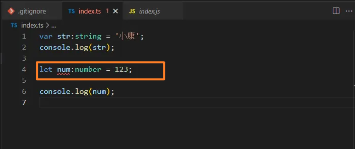
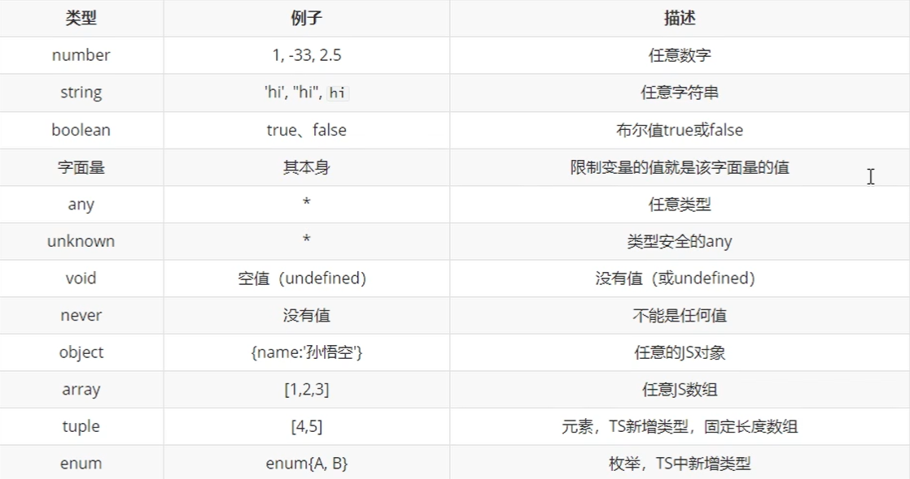

# TypeScript学习笔记

### 1. 安装TS

1. 全局安装

```bash
npm install typescript@latest -g
```

2. 在根目录下生成 `tsconfig.json` 文件

```bash
tsc  --init
```

以上这一步一定是要运行的，否则 `vscode` 会出现变量错误



3. 启动

```bash
tsc -w 文件名
```

### 2. TS的类型声明

1. 可以把类型用在`变量`当中

```typescript
//变量的使用
let num: number = 123;
console.log(123);
let str: string = '123';
console.log(str);
```

2. 可以把类型用在`函数`中，如函数的参数、返回值

```typescript
//函数的使用
function sum(a: number, b: number): number {
  return a + b;
}
let result = sum(123, 456);
console.log(result);
```

3. TS可以用的其他类型



4. 可以使用 `| `来连接多个类型 (联合类型)

```typescript
let b: "male" | "female";
b = "male";
b = "female";
b = "123" //这是不行的

//boolean | string

let c: boolean | string;
c = true;
c = 'hello';

```

5. `any`表示默认关闭TS

```typescript
//any 表示的是任意类型, 一个变量设置类型为 any 后相当于对该变量关闭TS的类型检测, 使用TS时, 不建议使用 any 类型。

let d: any;
d = 10;
d = "hello";
d = true;

//如果变量后面不加 any, 会自动加上。
let f;
f = 10;
f = "hello";
f = true;
```

6. `unknown`表示未知类型的值

```typescript
//unknown 表示未知类型的值
let e: unknown;
e=10;
e="hello";
e=true;

//unknown 不能把定义好的类型赋值给 unknown 的变量
let s:string = '123';
s=e; //报错

// unknown 实际上就是一个类型安全的any
// unknown 类型的变量，不能直接赋值给其他变量
//解决报错 s = e 的办法, 赋值前进行类型检测, 这样就不会报错了
if (typeof e === "string") {
  s = e;
}

//类型断言, 可以用来告诉解析器变量的实际类型, 也可以解决 s = e 报错
s = e as string;
s = <string>e;
```

7. `void`用来表示空

```typescript
// void 用来表示空, 一函数为例, 就表示没有返回值的函数, 但可以返回 undefined
function fn(): void {
    return undefined;
}
```

8. `never` 表示永远不会返回结果

```typescript
// never 表示永远不会返回结果
function fn2(): never {
  throw new Error("报错了! ");
}
```

9. `object` 表示一个 js 对象

```typescript
let a: object;
a = {};
a = function () {

}

// {} 用来指定对象中可以包含哪些属性
// 语法：{属性名:属性值, 属性名:属性值}
// 在属性名后边加上?, 表示属性是可选的

let g: { name: string, age?: number };
g = { name: '孙悟空', age: 18 };

// [propName: string]: any
let h: { name: string, [propName: string]: any }
h = {name:'猪八戒', age:18, gender:'男'};


//比较常用的写法
// [propName: string]: any
let h: { name: string, [propName: string]: any }
h = { name: '猪八戒', age: 18, gender: '男' };

// 设置函数结构的类型声明

let j: (a: string, b: string) => number;
j = function (n1: string, n2: string): number {
  return 10;
}

// string 表示字符串数组
let v: string[];
v = ['a', 'b', 'c'];

//number[] 表示数值
let w: number[];
w = [1, 2, 3];

let m: Array<number>;
m = [1, 2, 3];
```

10. 元组

```typescript
//元组就是固定长度的数组

let h: [string, number]; //可以写多个类型
h = ['hello', 123];
```

11. `enum`枚举

```typescript

enum Gender {
  Male,
  Female
}

let i: { name: string, gender: Gender };
i = {
  name:'孙悟空',
  gender:Gender.Male 
}

console.log(i.gender === Gender.Male); //true
```

### 3. TS的编译选项（tsconfig.json）

```json
{
  /* 
      tsconfig.json 是ts编译器的配置文件，ts编译器可以更具它的信息来对代码进行编译
      "include" 用来表示指定哪些ts文件需要被编译
      路径；
          *表示任意文件，
          **表示任意目录
      "exclude" 用来表示不需要被编译的文件目录
              默认值：{"node_modules", "bower_components", "jspm_packages"}
  */
      "include": [
          "./src/**/*"
      ],
      
      // "exclude": [
      //     "./src/hello/**/*"
      // ]
  
      //compilerOptions 编译器的选项 
      "compilerOptions": {
          //target 用来指定ts被编译为ES的版本
          //'es3', 'es5', 'es6', 'es2015', 'es2016', 'es2017', 'es2018', 'es2019', 'es2020', 'esnext'.
          "target": "ES2015",
  
          //module 指定要使用的模块化的规范
          //'none', 'commonjs', 'amd', 'system', 'umd', 'es6', 'es2015', 'es2020', 'esnext'
          "module": "es2015",
          
          //lib 用来指定项目所用的库
          // 'es5', 'es6', 'es2015', 'es7', 'es2016', 'es2017', 'es2018', 'es2019', 'es2020', 'esnext', 'dom', 
          // 'dom.iterable', 'webworker', 'webworker.importscripts', 'webworker.iterable', 'scripthost', 'es2015.core', 'es2015.collection', 
          // 'es2015.generator', 'es2015.iterable', 'es2015.promise', 'es2015.proxy', 'es2015.reflect', 'es2015.symbol', 'es2015.symbol.wellknown', 'es2016.array.include',
          //  'es2017.object', 'es2017.sharedmemory', 'es2017.string', 'es2017.intl', 'es2017.typedarrays', 'es2018.asyncgenerator', 'es2018.asynciterable', 'es2018.intl', 
          // 'es2018.promise', 'es2018.regexp', 'es2019.array', 'es2019.object', 'es2019.string', 'es2019.symbol', 'es2020.bigint', 'es2020.promise', 
          // 'es2020.sharedmemory', 'es2020.string', 'es2020.symbol.wellknown', 'es2020.intl', 'esnext.array', 'esnext.symbol', 'esnext.asynciterable', 'esnext.intl',
  
  
          //outDir 用来指定编译后文件所在的目录
          "outDir": "./dist",
  
          //outFile 将代码合并为一个文件
          // "outFile": "./dist/app.js",
  
          // 是否对js文件进行编译，默认是false
          "allowJs": true,
  
          // 是否检查js代码是否符合语法规范，默认值是false
          "checkJs": true,
  
          // 是否移除注释
          "removeComments": true,
  
          // 不生成编译后的文件
          "noEmit": false,
  
          // 当有错误时不生成编译文件
          "noEmitOnError": true,
  
          // 所有严格检查的总开关
          "strict": true,
  
          // 用来设置编译后的文件是否使用严格模式，默认是false
          "alwaysStrict": true,
  
          // 不允许隐式的any类型
          "noImplicitAny": true,
  
          // 不允许不明确类型的this
          "noImplicitThis": true,
  
          // 严格检查空值
          "strictNullChecks": true
  
  
      }
  }
```

### 4. webpack打包TS

1. 安装webpack

```bash
npm i -D webpack-cli typescript ts-loader
```

2. 自动生成html

```bash
npm i -D html-webpack-plugin
```

3. 自动响应浏览器更新

```bash
npm i -D webpack-dev-server
```

4. 清除dist目录旧文件

```bash
npm i -D clean-webpack-plugin
```

5. webpack 中所有的配置信息都应该写在`module.exports`中

```javascript
module.exports = {
    mode: 'none',
    // 指定入口文件
    entry: "./src/index.ts",

    // 指定打包文件所在目录
    output: {
        //指定打包文件的目录
        path: path.resolve(__dirname, 'dist'),
        //打包后文件的名字
        filename: "bundle.js",
        //告诉webpack不使用箭头函数
        environment: {
            arrowFunction: false
        }

    },
    //指定webpack打包时要使用的模块
    module: {
        // 指定要loader加载的规则
        rules: [
            {
                // test指定的时规则生效的文件
                test: /\.ts$/,//以ts结尾的文件
                // 要使用的loader
                use: [
                    // 配置babel
                    {
                        //指定加载器
                        loader: "babel-loader",
                        // 设置babel
                        options: {
                            //设置预定义的环境
                            presets: [
                                [
                                    //指定环境的插件
                                    "@babel/preset-env",
                                    // 配置信息
                                    {
                                        // 要兼容的目标浏览器及版本
                                        targets: {
                                            "chrome": "58",
                                            "ie": "11"
                                        },
                                        //指定corejs的版本
                                        "corejs": "3",
                                        //使用corejs的方式 "usage"  表示按需加载
                                        "useBuiltIns": "usage" 
                                    }

                                ]
                            ]
                        }
                    },
                    // 'babel-loader',
                    'ts-loader'
                ],
                // 要排除的文件
                exclude: /node-modules/
            }
        ]
    },

    //配置Webpack 插件
    plugins: [
        new CleanWebpackPlugin(),
        new HTMLWebpackPlugin({
            // title: "这是一个自定义的title"、
            template: "./src/index.html" 
        }),
    ],

    // 用来设置引用模块，可以将这些文件识别为模块
    resolve: {
        extensions: ['.ts', '.js']
    }
}


```

### 5. 面向对象

面向对象是程序中一个非常重要的思想，它被很多同学理解成了一个比较难，比较深奥的问题，其实不然。面向对象很简单，简而言之就是程序之中所有的操作都需要通过对象来完成。

- 举例来说：
  - 操作浏览器要使用window对象
  - 操作网页要使用document对象
  - 操作控制台要使用console对象

一切操作都要通过对象，也就是所谓的面向对象，那么对象到底是什么呢？这就要先说到程序是什么，计算机程序的本质就是对现实事物的抽象，抽象的反义词是具体，比如：照片是对一个具体的人的抽象，汽车模型是对具体汽车的抽象等等。程序也是对事物的抽象，在程序中我们可以表示一个人、一条狗、一把枪、一颗子弹等等所有的事物。一个事物到了程序中就变成了一个对象。

在程序中所有的对象都被分成了两个部分数据和功能，以人为例，人的姓名、性别、年龄、身高、体重等属于数据，人可以说话、走路、吃饭、睡觉这些属于人的功能。数据在对象中被成为属性，而功能就被称为方法。所以简而言之，在程序中一切皆是对象。

##### 1、类（class）

要想面向对象，操作对象，首先便要拥有对象，那么下一个问题就是如何创建对象。要创建对象，必须要先定义类，所谓的类可以理解为对象的模型，程序中可以根据类创建指定类型的对象，举例来说：可以通过Person类来创建人的对象，通过Dog类创建狗的对象，通过Car类来创建汽车的对象，不同的类可以用来创建不同的对象。

- 定义类：

  - ```typescript
    class 类名 {
    	属性名: 类型;
    	
    	constructor(参数: 类型){
    		this.属性名 = 参数;
    	}
    	
    	方法名(){
    		....
    	}
    
    }
    ```

- 示例：

  - ```typescript
    class Person{
        name: string;
        age: number;
    
        constructor(name: string, age: number){
            this.name = name;
            this.age = age;
        }
    
        sayHello(){
            console.log(`大家好，我是${this.name}`);
        }
    }
    ```

- 使用类：

  - ```typescript
    const p = new Person('孙悟空', 18);
    p.sayHello();
    ```

##### 2、面向对象的特点

- 封装

  - 对象实质上就是属性和方法的容器，它的主要作用就是存储属性和方法，这就是所谓的封装

  - 默认情况下，对象的属性是可以任意的修改的，为了确保数据的安全性，在TS中可以对属性的权限进行设置

  - 只读属性（readonly）：

    - 如果在声明属性时添加一个readonly，则属性便成了只读属性无法修改

  - TS中属性具有三种修饰符：

    - public（默认值），可以在类、子类和对象中修改
    - protected ，可以在类、子类中修改
    - private ，可以在类中修改

  - 示例：

    - public

      - ```typescript
        class Person{
            public name: string; // 写或什么都不写都是public
            public age: number;
        
            constructor(name: string, age: number){
                this.name = name; // 可以在类中修改
                this.age = age;
            }
        
            sayHello(){
                console.log(`大家好，我是${this.name}`);
            }
        }
        
        class Employee extends Person{
            constructor(name: string, age: number){
                super(name, age);
                this.name = name; //子类中可以修改
            }
        }
        
        const p = new Person('孙悟空', 18);
        p.name = '猪八戒';// 可以通过对象修改
        ```

    - protected

      - ```typescript
        class Person{
            protected name: string;
            protected age: number;
        
            constructor(name: string, age: number){
                this.name = name; // 可以修改
                this.age = age;
            }
        
            sayHello(){
                console.log(`大家好，我是${this.name}`);
            }
        }
        
        class Employee extends Person{
        
            constructor(name: string, age: number){
                super(name, age);
                this.name = name; //子类中可以修改
            }
        }
        
        const p = new Person('孙悟空', 18);
        p.name = '猪八戒';// 不能修改
        ```

    - private

      - ```typescript
        class Person{
            private name: string;
            private age: number;
        
            constructor(name: string, age: number){
                this.name = name; // 可以修改
                this.age = age;
            }
        
            sayHello(){
                console.log(`大家好，我是${this.name}`);
            }
        }
        
        class Employee extends Person{
        
            constructor(name: string, age: number){
                super(name, age);
                this.name = name; //子类中不能修改
            }
        }
        
        const p = new Person('孙悟空', 18);
        p.name = '猪八戒';// 不能修改
        ```

  - 属性存取器

    - 对于一些不希望被任意修改的属性，可以将其设置为private

    - 直接将其设置为private将导致无法再通过对象修改其中的属性

    - 我们可以在类中定义一组读取、设置属性的方法，这种对属性读取或设置的属性被称为属性的存取器

    - 读取属性的方法叫做setter方法，设置属性的方法叫做getter方法

    - 示例：

      - ```typescript
        class Person{
            private _name: string;
        
            constructor(name: string){
                this._name = name;
            }
        
            get name(){
                return this._name;
            }
        
            set name(name: string){
                this._name = name;
            }
        
        }
        
        const p1 = new Person('孙悟空');
        console.log(p1.name); // 通过getter读取name属性
        p1.name = '猪八戒'; // 通过setter修改name属性
        ```

  - 静态属性

    - 静态属性（方法），也称为类属性。使用静态属性无需创建实例，通过类即可直接使用

    - 静态属性（方法）使用static开头

    - 示例：

      - ```typescript
        class Tools{
            static PI = 3.1415926;
            
            static sum(num1: number, num2: number){
                return num1 + num2
            }
        }
        
        console.log(Tools.PI);
        console.log(Tools.sum(123, 456));
        ```

  - this

    - 在类中，使用this表示当前对象

- 继承

  - 继承时面向对象中的又一个特性

  - 通过继承可以将其他类中的属性和方法引入到当前类中

    - 示例：

      - ```typescript
        class Animal{
            name: string;
            age: number;
        
            constructor(name: string, age: number){
                this.name = name;
                this.age = age;
            }
        }
        
        class Dog extends Animal{
        
            bark(){
                console.log(`${this.name}在汪汪叫！`);
            }
        }
        
        const dog = new Dog('旺财', 4);
        dog.bark();
        ```

  - 通过继承可以在不修改类的情况下完成对类的扩展

  - 重写

    - 发生继承时，如果子类中的方法会替换掉父类中的同名方法，这就称为方法的重写

    - 示例：

      - ```typescript
        class Animal{
            name: string;
            age: number;
        
            constructor(name: string, age: number){
                this.name = name;
                this.age = age;
            }
        
            run(){
                console.log(`父类中的run方法！`);
            }
        }
        
        class Dog extends Animal{
        
            bark(){
                console.log(`${this.name}在汪汪叫！`);
            }
        
            run(){
                console.log(`子类中的run方法，会重写父类中的run方法！`);
            }
        }
        
        const dog = new Dog('旺财', 4);
        dog.bark();
        ```

      - 在子类中可以使用super来完成对父类的引用

  - 抽象类（abstract class）

    - 抽象类是专门用来被其他类所继承的类，它只能被其他类所继承不能用来创建实例

    - ```typescript
      abstract class Animal{
          abstract run(): void;
          bark(){
              console.log('动物在叫~');
          }
      }
      
      class Dog extends Animals{
          run(){
              console.log('狗在跑~');
          }
      }
      ```

    - 使用abstract开头的方法叫做抽象方法，抽象方法没有方法体只能定义在抽象类中，继承抽象类时抽象方法必须要实现
    
    

##### 3、接口（Interface）

接口的作用类似于抽象类，不同点在于接口中的所有方法和属性都是没有实值的，换句话说接口中的所有方法都是抽象方法。接口主要负责定义一个类的结构，接口可以去限制一个对象的接口，对象只有包含接口中定义的所有属性和方法时才能匹配接口。同时，可以让一个类去实现接口，实现接口时类中要保护接口中的所有属性。

- 示例（检查对象类型）：

  - ```typescript
    interface Person{
        name: string;
        sayHello():void;
    }
    
    function fn(per: Person){
        per.sayHello();
    }
    
    fn({name:'孙悟空', sayHello() {console.log(`Hello, 我是 ${this.name}`)}});
    
    ```

- 示例（实现）

  - ```typescript
    interface Person{
        name: string;
        sayHello():void;
    }
    
    class Student implements Person{
        constructor(public name: string) {
        }
    
        sayHello() {
            console.log('大家好，我是'+this.name);
        }
    }
    ```

  - 


##### 4、泛型（Generic）

定义一个函数或类时，有些情况下无法确定其中要使用的具体类型（返回值、参数、属性的类型不能确定），此时泛型便能够发挥作用。

- 举个例子：

  - ```typescript
    function test(arg: any): any{
    	return arg;
    }
    ```

  - 上例中，test函数有一个参数类型不确定，但是能确定的时其返回值的类型和参数的类型是相同的，由于类型不确定所以参数和返回值均使用了any，但是很明显这样做是不合适的，首先使用any会关闭TS的类型检查，其次这样设置也不能体现出参数和返回值是相同的类型

  - 使用泛型：

  - ```typescript
    function test<T>(arg: T): T{
    	return arg;
    }
    ```

  - 这里的```<T>```就是泛型，T是我们给这个类型起的名字（不一定非叫T），设置泛型后即可在函数中使用T来表示该类型。所以泛型其实很好理解，就表示某个类型。

  - 那么如何使用上边的函数呢？

    - 方式一（直接使用）：

      - ```typescript
        test(10)
        ```

      - 使用时可以直接传递参数使用，类型会由TS自动推断出来，但有时编译器无法自动推断时还需要使用下面的方式

    - 方式二（指定类型）：

      - ```typescript
        test<number>(10)
        ```

      - 也可以在函数后手动指定泛型

  - 可以同时指定多个泛型，泛型间使用逗号隔开：

    - ```typescript
      function test<T, K>(a: T, b: K): K{
          return b;
      }
      
      test<number, string>(10, "hello");
      ```

    - 使用泛型时，完全可以将泛型当成是一个普通的类去使用

  - 类中同样可以使用泛型：

    - ```typescript
      class MyClass<T>{
          prop: T;
      
          constructor(prop: T){
              this.prop = prop;
          }
      }
      ```

  - 除此之外，也可以对泛型的范围进行约束

    - ```typescript
      interface MyInter{
          length: number;
      }
      
      function test<T extends MyInter>(arg: T): number{
          return arg.length;
      }
      ```

    - 使用T extends MyInter表示泛型T必须是MyInter的子类，不一定非要使用接口类和抽象类同样适用。
