# 历年政治大题

### 2010

##### 一、辨析题

> 帝国主义是中国革命的首要对象，是中国人民第一个和最凶恶的敌人

正确。

为什么？

- 压缩版本

1. 最大的压迫——>来自帝国主义——>带来了战争——>导致了战祸——>半殖民地半封建社会
2. 通过战争——>操纵了财政和经济——>政治和军事——>阻碍中国的发展——>落后
3. 推翻帝国主义——>走向民族独立和富强

- 解压版本

1. 近代中国受到的最大的压迫是来自于帝国主义民族的压迫，帝国主义给中国人民带来了无尽的灾难和战祸，使中国进入了半殖民地半封建社会。
2. 帝国主义通过野蛮的侵略战争，不但操纵了近代中国的财政和经济命脉，而且还操纵了近代中国的政治和军事力量，是阻碍了近代中国的发展，是近代中国落后的最主要因素。
3. 只有推翻帝国主义，才能使中国走向民族独立和富强。

- 标准版本

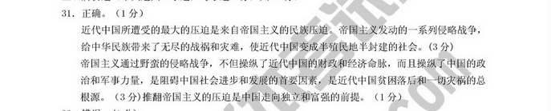

> 科学发展观的核心是统筹兼顾

错误。

为什么？

- 压缩版本

1. 核心——>以人为本——>人民利益为本——>发展——>为了人民、依靠人民、成果由人民共享
2. 以人为本——>马克思主义唯物论基本原理——>全心全意为人民服务——>推动社会发展

- 解压版本

1. 科学发展观的核心是以人为本，以人为本，就是以人民的利益为本，发展为了人民、依靠人民、发展成功由人民共享。
2. 以人为本，体现了马克思主义唯物论的基本原理，体现了我们党全心全意为人民服务的根本宗旨和推动我们社会发展的根本要求。

- 标准版本

##### 二、简答题

> 简述中国的发展离不开世界的原因

- 压缩版本

1. 当今世界——>开放——>深刻总结——生产、商品、市场经济发展的必然结果——如果不实行改革开放——>限制自己的发展——>给国家带来灾祸
2. 中国发展——>离不开世界——>深刻总结——>中国落后——>闭关锁国——>想要发展起来——>对外开放——>新中国——>总会遇到难题——>怎么办——>对外开放——>能够解决什么——>经济建设的矛盾和困难

- 解压版本

1. 当今的世界是开放的世界，这是过去历史的深刻总结，这是生产社会化、商品化和市场经济发展的必然结果，如果不实行改革开放，就会限制自己的发展，也很有可能会给民族带来灾难。
2. 当今中国的发展离不开世界，这是过去历史的深刻总结，以前中国落后，正是因为闭关锁国，要想发展起来，必须对外开放。我们新中国的建设总会遇到难题和矛盾，对外开放不仅能帮助我们解决困难，也有利于中国的长期发展。

- 标准版本

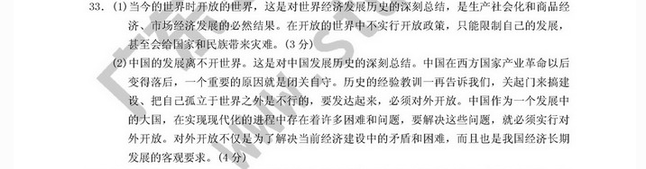

> 简述中国走和平发展道路的必然性

- 压缩版本

1. 走和平发展道路——>时代发展和自身根本利益
2. 发展——>不能靠掠夺——>只能走中国特色社会主义道路——>对世界和平发展有意义
3. 发展——>基于中国历史文化——>渴望和平、追求和谐——>精神特征
4. 发展——>是时代潮流——>各国人民的的心愿——>要发展——>求和平

- 解压版本

1. 坚持走和平发展道路，是中国政府和中国人民跟随时代的发展和自身利益的战略抉择。
2. 坚持走和平发展道路，是因为我们不能通过掠夺发展起来，只能坚持走中国特色社会主义道路，这对世界的和平发展具有重要的意义。
3. 坚持走和平发展道路，是基于中华历史文化，我们渴望和平、最求和谐，这是我们中华民族的精神特征。
4. 坚持走和平发展道路，是时代的潮流，是各国人民共同的心愿，是时代发展不可阻挡的趋势，想要发展起来，就要坚持走和平发展道路。

- 标准版本

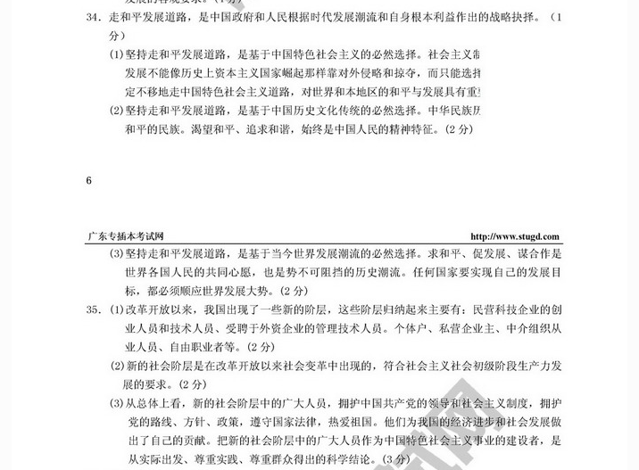

> 简述新的社会阶层是中国特色社会主义事业的建设者的依据

- 压缩版本

1. 改革开放——>出现了一些新的阶级——>民营科技企业的创业人员和技术人员、受外聘的外资企业的管理技术人员——>个体户、私营企业主、中介从业人员、自由职业——>他们都是在变革中出现的——>符合社会初级阶段发展的要求
2. 新的社会阶级——>拥护党的领导——>成为建设者

- 解压版本

1. 改革开放之后，我们国家出现了一些新的阶级，这些阶级包括民营科技企业的创业和技术人员、受外聘的外资企业的管理技术人员还包括个体户、私营企业主、中介人员和自由从业者。他们都是在发展中出现的，是符合社会初级阶段的发展要求的。
2. 出现的新的社会阶级，他们不但拥护党的领导、遵循国家的要求，而且还遵守法律法规，他们在新的时代中为国家做出了贡献，成为中国特色社会主义的建设者。

- 标准版本

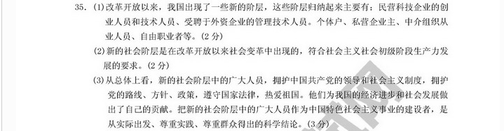

##### 三、论述题

> 论述新时期我国建设社会主义新农村的重大意义

- 压缩版本

1. 科学发展
2. 现代化建设
3. 全面建设小康
4. 国民经济
5. 社会主义和谐

- 解压版本

1. 贯彻落实科学发展的重大举措
2. 确保我国现代化建设的必然要求
3. 全面建设小康社会的重点任务
4. 保持国民经济的持久力
5. 构建社会主义的重要依据

- 标准版本

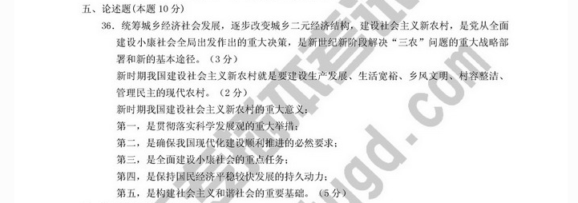

##### 四、材料分析题

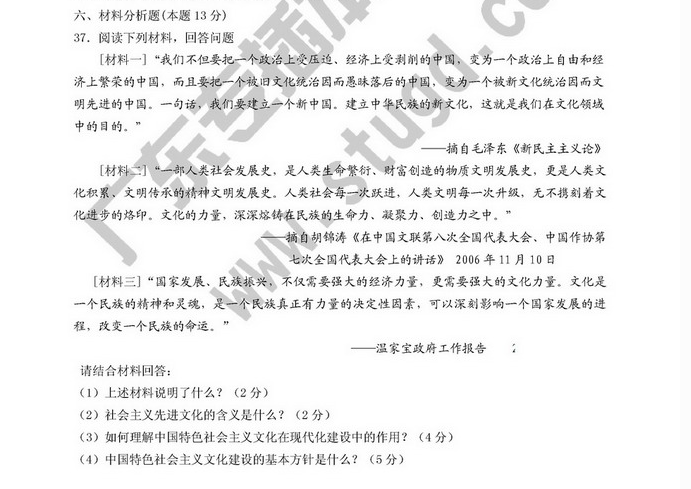

> 1.上述材料说明了什么？

上述材料说明了文化的重要性以及党重视文化的建设。

> 2.社会主义先进文化的含有是什么？

1. 符合人类社会发展
2. 符合人类精神文明的传承
3. 具有民族的生命力、凝聚力和创造力

> 3.如何理解中国特色社会主义文化在现代化建设中的作用？

- 压缩版本

1. 社会主义建设的重要内容
2. 人民力量的凝聚——>综合国力的标志
3. 精神动力

- 解压版本

1. 它是社会主义建设的重要内容。
2. 这是人民力量的凝聚，是体现综合国力的重要标志。
3. 这是中国特色社会主义现代化提供的精神动力和思想保证。

- 标准版本

> 4.中国特色社会主义文化建设的基本方针是什么？

1. 坚持马克思主义为指导，为人民服务，为社会服务。
2. 坚持百花齐放，百家争鸣的方针。
3. 坚持发展依靠群众，为了群众，建设成功由人民共享，不断推进文化创新。
4. 坚持传承中华优秀文化，吸取外来优秀文化。
5. 坚持经济发展和加强对社会主义建设的领导。

---

### 2011

##### 一、辨析题

> 中国特色社会主义理论体系是不断发展的开放的理论体系

正确。

为什么？

- 压缩版本

1. 中国特色社会理论体系——>邓小平理论——>三个代表——>科学发展观
2. 中国特色社会理论体系——>马克思主义——>毛泽东思想——>党最宝贵的政治和精神财富——>全国人民团结奋斗共同思想的基础

- 解压版本

1. 中国特色社会理论体系，包含了邓小平理论和“三个代表”重要思想已经科学发展观重大战略思想在内的科学理论体系。
2. 中国特色社会理论体系，坚持和发展了马克思主义、毛泽东思想，凝结了几代中国共产党人带领人民不断探索实践的智慧和心血，是马克思主义中国化最新的理论成果，是党最宝贵的精神财富，是全国各族人民团结奋斗共同思想基础。中国特色社会主义理论体系是不断发展的新的理论体系。

- 标准版本

> 社会主义和市场经济之间存在着根本矛盾

错误。

为什么？

- 压缩版本

1. 传统观念——>计划经济是社会主义经济特征——>市场经济是资本主义经济——>社会主义必然实行计划经济——>资本主义必然实行市场经济
2. 改革开放——>发展过程中对市场经济有了新认识——>他们各有优势——>社会主义经济不存在矛盾

- 解压版本

1. 传统观念认为，计划经济是属于社会主义经济特征，市场经济属于资本主义经济，社会主义必然实行计划经济，而资本主义必然实行市场经济。
2. 改革开放以来，我们对发展过程中的市场经济有了新的认识，计划经济和市场经济各有优势和长处，所以他们呢之间不存在矛盾。

- 标准版本

##### 二、简答题

> 简答社会主义核心价值观体系的社会主义内容及相互关系

- 压缩版本

1. 社会主义核心价值观——>马克思指导思想——>中国特色社会主义的共同理想——>爱国为核心——>民族精神&&改革创新——>时代精神、社会主义荣辱观
2. 中国特色社会主义重要组成部分——>相互联系、相互贯通、是一个整体——>思想文化成果
3. 马克思&&价值观——>突出主题——>培养精神——>掌握精髓——>树立荣辱观——>打牢基础

- 解压版本

1. 社会主义核心价值观，体现了马克思主义指导思想和中国特色社会主义的共同理想，以爱国为核心的民族精神和改革创新的时代精神、社会荣辱观。
2. 中国特色社会主义重要的组成部分包括相互联系、相互贯通、是一个整体，这是党领导人民在发展过程中丰富思想文化概括出来的精华。
3. 坚持马克思主义的指导地位，抓住社会主义核心价值观的灵魂，掌握社会主义核心价值观的精髓，树立社会主义核心价值观的荣辱观，大佬社会主义核心价值观的基础。

- 标准版本

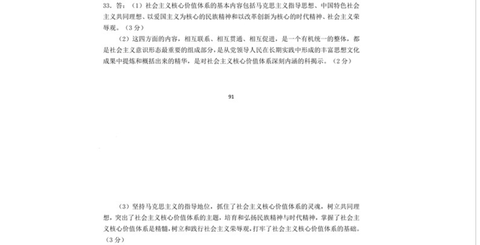

> 为什么要坚持和完善民族区域自治制度

- 压缩版本

1. 民族自治——>解决民族问题的基本政策——>基本国家政治制度——>为了民族平等、团结、合作和共同繁荣
2. 核心——>人民当家做主
3. 依靠群众——为了群众——>从群众中来——>到群众中去——>全心全意为人民服务——>保持党同人民血肉联系

- 解压版本

1. 坚持完善民族自治制度，是为了解决民族问题的基本政策和国家的基本政治制度，这都是为了民族平等，民族团结和民族共同繁荣。
2. 坚持民族自治的核心是体现了人民当家做主，管理民族，符合实现发展的要求。
3. 坚持民主自治，是一切为了群众，一切依靠群众，从群众中来，到群众中去，全心全意为人民服务，保持党和人民的血肉联系。

- 标准版本

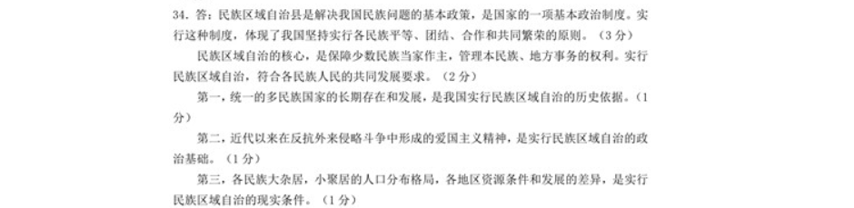

> 简答保持党同人民群众的血肉联系的重要意义

- 压缩版本

1. 最大优势——>密切联系群众——>关系党的生死存亡
2. 为了群众——>体现了马克思主义的本质要求——>全新全意为人民服务
3. 长期执政的关键——>克服困难的根本保证
4. 落实方针和政策——>行动、生成

- 解压版本

1. 中国共产党最大的优势是密切联系群众，这点关系到党的生死存亡。
2. 一切为了群众，一切依靠群众，这是体现了马克思主义思想的本质要求，全心全意为人民服务是我们党的根本宗旨。
3. 人民群众是我们党长期执政的关键，也是战胜和克服困难的根本保证。
4. 坚持保持党同人民群众的血肉联系，就要落实方针和政策，从群众中来，到群众中去。

- 标准答案

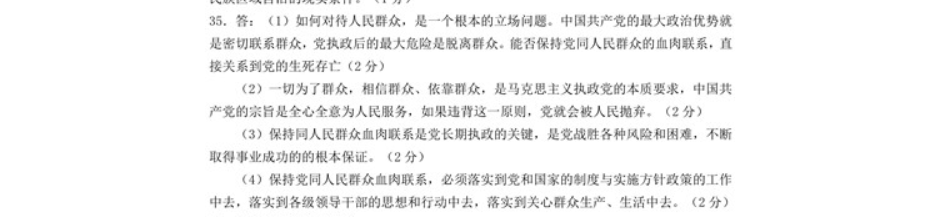

##### 三、论述题

略……

##### 四、材料分析题

略……

### 2012

##### 一、辨析题

> 发展才是硬道理

正确。

为什么？

- 压缩版本

1. 邓小平——>历史总结——>发展社会生产力的重要性
2. 发展——>根本任务——>符合马克思主义基本原理
3. 发展——>总结
4. 发展——>适应时代潮流

- 解压版本

1. 发展才是硬道理，是邓小平对过去历史的深刻总结，这对发展社会生产力很重要。
2. 发展才是硬道理，是发展生产力的根本任务，符合马克思主义的基本原理。
3. 发展才是硬道理，这是社会主义实践过程中的总结。
4. 发展才是硬道理，符合时代潮流的发展。

- 标准版本

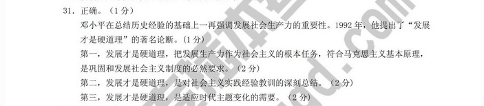

> 对外开放和独立自主、自立更生两者是完全对立的

错误。

为什么？

- 压缩版本

1. 对外开放、自力更生是辩证统一的——>不是对立的
2. 立足点——>革命和建设的基本经验和重要原则——>不是闭关锁国
3. 对外开放、自力更生——>相辅相成

- 解压版本

1. 对外开放和自立更生是辩证统一的，不是对立的。
2. 坚持独立自主，自力更生是我们的立足点，是中国社会主义革命和建设的基本经验和重要原则，但不是闭关锁国。
3. 对外开放、自立更生是相辅相成的，对立是不存在的。

- 标准版本

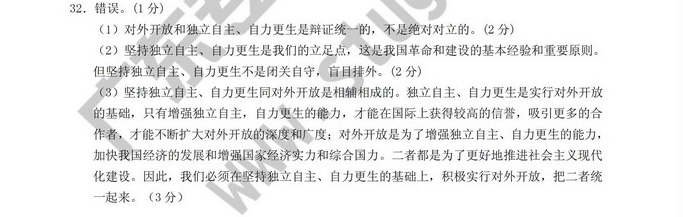

##### 二、简答题

> 简述科学发展观的主要内容

- 压缩版本

1. 科学发展观——>核心——>以人为本——>以人民利益为本
2. 科学发展观——>全心全意为人民的本质要求
3. 科学发展观——>一切为了人民、依靠人民，发展成果由人民共享
4. 科学发展观——>基本要求——>全面协调可持续发展
5. 全面发展——>推进经济、政治、文化、社会——全面进步

- 解压版本

1. 科学发展观的核心是以人为本，一起发展都以人民利益为本。
2. 科学发展观，是我们党全心全意为人民服务的本质要求。
3. 科学发展观，就是以人文本，一切为了人民、一切依靠人民，发展成果由人民共享。
4. 科学发展观的基本要求是全面协调可持续发展。
5. 全面协调可持续发展，就是推进经济、文化、政治和社会的全面进步。

- 标准版本

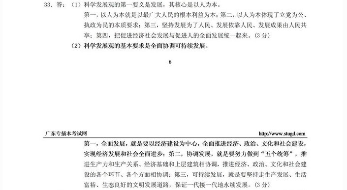

> 如何正确理解社会主义社会民主的

- 压缩版本

1. 历史和现实说明——>民主、内容、形式——>是随着经济发展而改变——>不唯一
2. 民主形式多样——>对比——>民主实质——>排在第二位
3. 社会主义民主建立在生产资料公有制基础上——>人民享有民主
4. 逐步发展的过程——>经济文化状况关联

- 解压版本

1. 通过历史和现实说明。任何一种民主民主的本质、内容、形式都是随着时代改变的，并不唯一。
2. 民主形式是多样的，和民主实质对比，它是排在第二位的。
3. 社会主义民主建设在生产资料公有制的基础上，使广大人民享有民主。
4. 民主建设在逐步发展中，它是和经济文化状况相关联的。

- 标准版本

> 简答新世纪加强国防和人民军队建设的重要意义

- 直接背诵版本

1. 人民解放军是保卫和建设中国特色社会主义的重要力量，加强人民军队建设使维护国家安全统一和全面建成小康社会的重要保障。加强国防和军队建设，在中国特色社会主义事业总体布局中占有重要地位。
2. 人民解放军使人民民主专政的坚强柱石。
3. 人民解放军使建设中国特色社会主义的重要力量。搞好军队建设，增强国防实力，是全面增强国家综合实力的重要内容。

- 标准版本

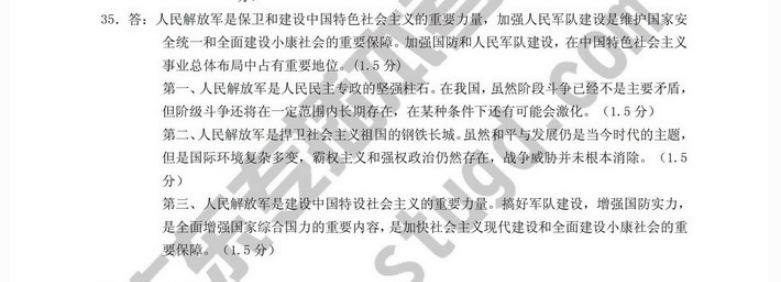

##### 三、论述题

> 如何维护世界和平、促进共同发展

##### 四、材料分析题

略……
