### 历年真题作文分析（2010-2022）

> 以下仅作为娱乐分析

---

> 2010

- 申请信

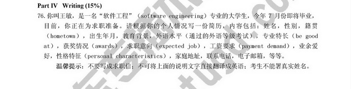

> 2011

- 祝贺信

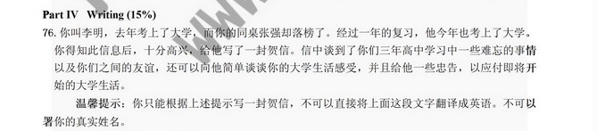

> 2012

- 邀请信

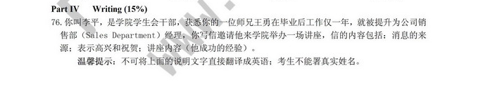

> 2013

- 申请信

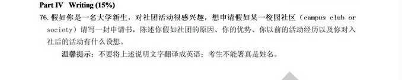

> 2014

- 建议信

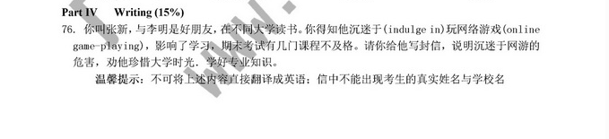

> 2015

- 告知信

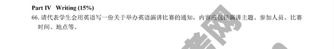

> 2016

- 申请信

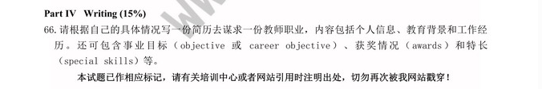

> 2017

- 投诉信

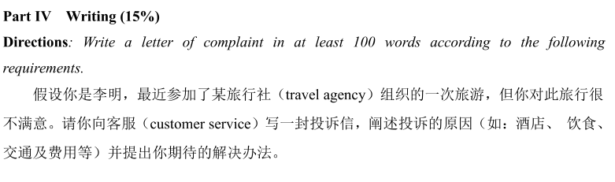

> 2018

- 邀请信

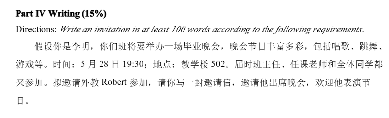

> 2019

- 告知信

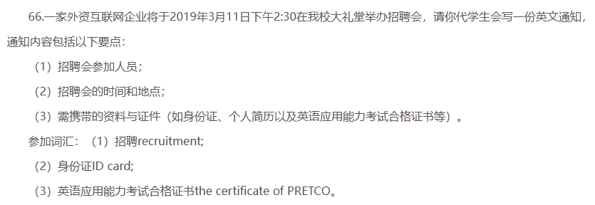

> 2020

- 告知信

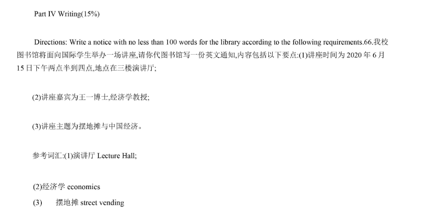

> 2021

- 咨询信

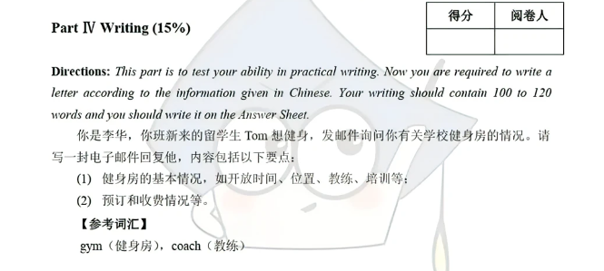

> 2022

- 邀请信

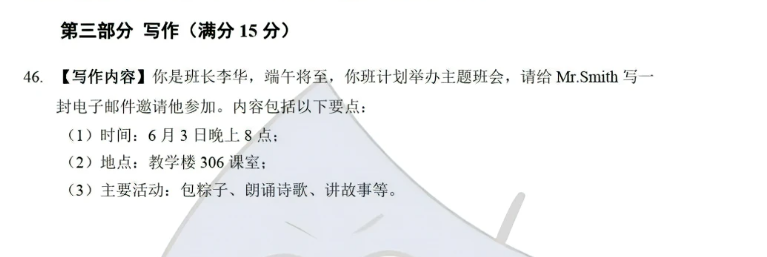

> 2023 (???)

- 结合历年真题（过去12年）考过的书信统计各类型考过的次数：
- 申请信 3
- 祝贺信 1
- 邀请信 3
- 建议信 1
- 告知信 3
- 投诉信 1
- 咨询信 1

---

- 最先重点背诵（在过去12年都考过多次）

  - 申请信
  - 邀请信
  - 告知信
- 其次重点背诵（已经隔了很多年没考过了，今年会不会考呢）

  - 祝贺信（2011）
  - 建议信（2014）
- 最后重点背诵（在过去的十二年中，从来都没考过的，今年有没有可能突然考一下呢）

  - 介绍信
  - 推荐信
- 当然，咨询信也是有可能考的（2019-2020连续两年考了告知信，同理，会不会2022-2023年也来一个连续两年考咨询信呢）
- 至于投诉信/抱怨信为什么不把它列入背诵等级里面（现在国家都是在鼓励一种正能量的价值观，这种对社会有消极作用的作文出现的概率很小很小。高考作为书信作为的标杆，也已经很多年没考过抱怨信了。）

### 作文模板

> 点击链接下载：

[辉哥独家高考英语写作模板](https://images.codeslive.top/doc/%E8%BE%89%E5%93%A5%E7%8B%AC%E5%AE%B6%E9%AB%98%E8%80%83%E8%8B%B1%E8%AF%AD%E5%86%99%E4%BD%9C%E6%A8%A1%E6%9D%BF.pdf)

[2019考前1小时辉哥附体宝典（含作文大招）](https://images.codeslive.top/doc/2019%E8%80%83%E5%89%8D1%E5%B0%8F%E6%97%B6%E8%BE%89%E5%93%A5%E9%99%84%E4%BD%93%E5%AE%9D%E5%85%B8%EF%BC%88%E5%90%AB%E4%BD%9C%E6%96%87%E5%A4%A7%E6%8B%9B%EF%BC%89.pdf)

> 下载文件地址

1. http://u5n.cn/PGlOp
2. http://u5n.cn/wUu5s

