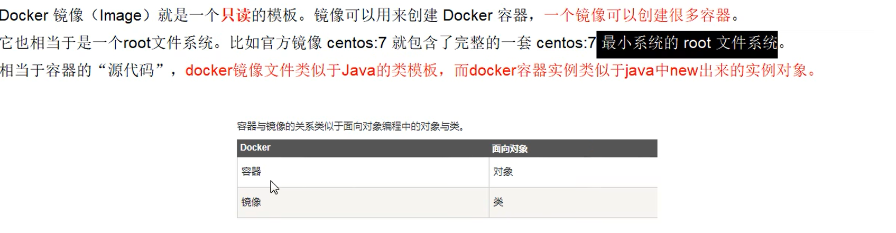
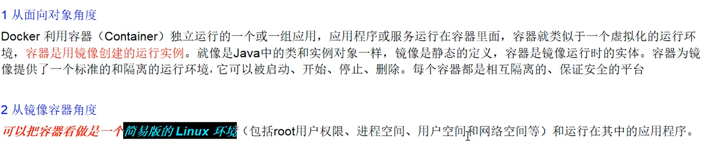
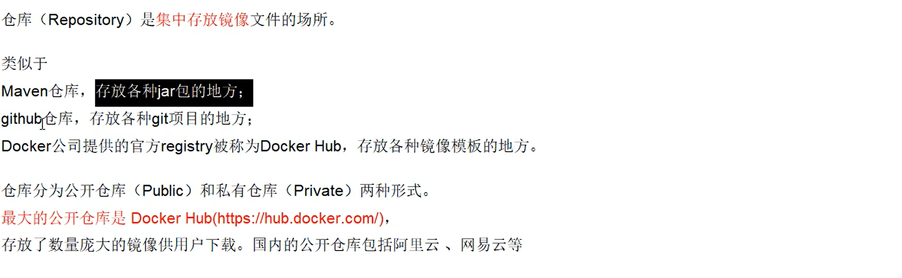
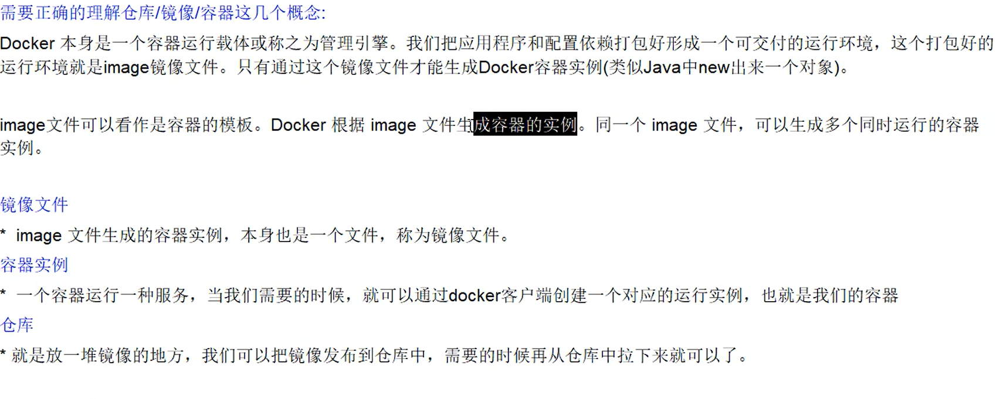
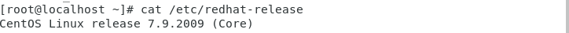
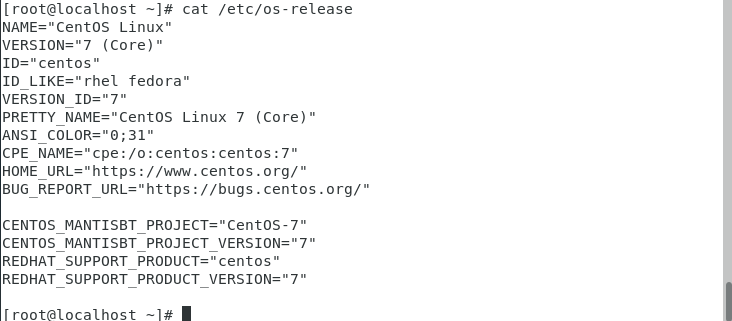
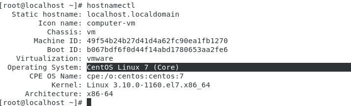
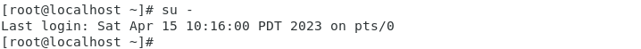

# docker学习笔记

### docker的基本组成

1. 镜像



2. 容器



3. 仓库



> 小总结



### docker的安装

##### 1. 确定是`CentOS7`及`以上`的版本

> 1.1 查看CentOS系统版本的命令

1.1.1 此命令将显示您正在运行的 CentOS 版本的信息

```bash
cat /etc/redhat-release
```



1.1.2 此命令将显示您正在运行的 CentOS 版本、内核版本和其他相关信息

```bash
cat /etc/os-release
```




1.1.3 此命令将显示您正在运行的 CentOS 版本、内核版本和其他相关信息，同时还可以用来更改系统主机名和其他配置项

```bash
hostnamectl
```




> 1.2 切换root

```bash
su -
```



##### 2.  卸载旧版本

1. 停止并删除所有 Docker 容器

```bash
sudo docker stop $(sudo docker ps -a -q)
sudo docker rm $(sudo docker ps -a -q)
```

2. 卸载 Docker 软件包

```bash
sudo yum remove docker docker-client docker-client-latest docker-common docker-latest docker-latest-logrotate docker-logrotate docker-engine
```

3. 删除 Docker 数据目录

```bash
sudo rm -rf /var/lib/docker
```

4. 删除 Docker 镜像、容器卷等文件

```bash
sudo rm -rf /var/lib/docker
```

#####  3.  yum安装gcc相关

1. 安装gcc

```bash
yum -y install gcc
```

2. 安装gcc c++

```bash
yum -y install gcc c++
```

#####  4.  安装需要的软件包

```bash
yum install -y yum-utils
```

#####  5. 设置stable镜像仓库

1. 更新epel第三方软件库

```bash
sudo yum install epel-release
```

2. 配置阿里云镜像

```bash
yum-config-manager --add-repo http://mirrors.aliyun.com/docker-ce/linux/centos/docker-ce.repo
```

##### 6.  更新yum软件包索引

```bash
yum makecache fast
```

#####  7.  安装docker

```bash
yum -y install docker-ce-ci containerd.io
```

##### 8. 启动docker

```bash
systemctl start docker
```

##### 9. 测试

1. 查看版本

```bash
docker version
```

2. 安装hello-world

```bash
docker run hello-world
```

##### 10. 卸载

1. 停止docker

```bash
systemctl stop docker
```

2. 卸载docker

```bash
yum remove docker-ce docker-ce-li containerd.io
```

3. 删除docker数据目录

```
rm -rf /var/lib/docker
```

4. 删除containerd的数据目录

```bash
rm -rf /var/lib/containerd
```


### 阿里云镜像加速

1. 跳转地址

> https://promotion.aliyun.com/ntms/act/kubernetes.html

2. 配置镜像加速器

```bash
sudo mkdir -p /etc/docker
sudo tee /etc/docker/daemon.json <<-'EOF'
{
  "registry-mirrors": ["https://h2n7xez5.mirror.aliyuncs.com"]
}
EOF
sudo systemctl daemon-reload
sudo systemctl restart docker
```


### docker常用命令

##### 1. 帮助类命令

1. 启动docker

```bash
systemctl start docker
```

2. 停止docker

```bash
systemctl stop docker
```

3. 重启docker

```bash
systemctl restart docker
```

4. 查看docker状态

```bash
systemctl status docker
```

5. 开机启动

```bash
systemctl enable docker
```

6. 查看docker概要信息

```bash
docker info
```

7. 查看docker总体帮助文档

```bash
docker --help
```

8. 查看docker命令帮助文档

```bash
docker 具体命令 -- help
```

##### 2. 镜像命令

1. 列出本地主机上的命令

```bash
docker images
```

2. 查找镜像

```bash
docker search 镜像名字
```

3. 拉取镜像

```bash
docker pull 镜像名字   //默认拉取最新版
docker pull:镜像名字:版本号 //拉取指定的镜像版本
```

4. 查看镜像/容器/数据卷所占的空间

```bash
docker system df
```

5. 删除镜像

```bash
//删除单个
docker rmi -f 镜像ID
//删除多个
docker rmi -f 镜像名1:版本号 镜像名2:版本号
//删除全部
docker rmi -f ${docker images -qa}
```

##### 3.容器命令


